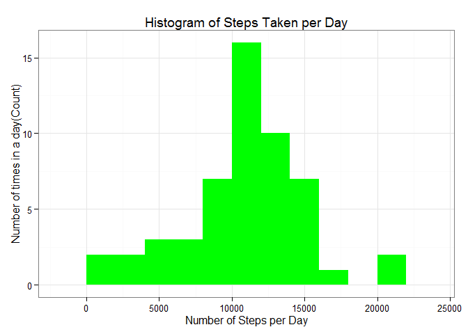
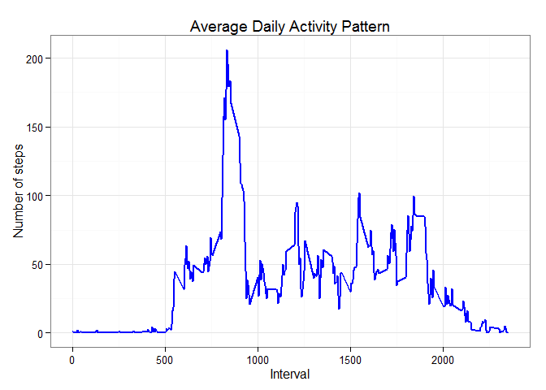
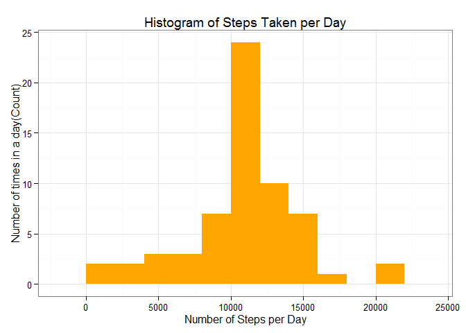
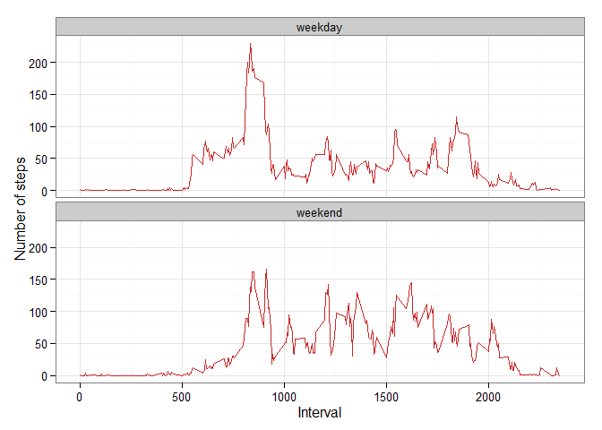

# Reproducible Research: Peer Assessment 1
###Reproducible Report Assignment 1

## Introduction 

This markdown document captures the steps taken to complete Assignment 1 of the Reproducible Research course offered on Coursera (This was attempted in August 2015).  In this assignment, data is taken from a personal tracker, at 5-minutes interval, for a period of two months. We are tasked to load the data, visualize it via graphs, calculate medians and means, and to replace missing data. Finally, we are tasked to consider if the personal activity patterns varries once the weekend arrives, as compared to the weekday.

I started this assignment by forking the stipulated github repo. The repo was cloned into my local folder. The following libraries were then loaded:

```r
library(knitr)
opts_chunk$set(echo = TRUE, results = 'hold')#load knitr library
library(data.table)#load data table library
library(ggplot2) # we shall use ggplot2 for plotting figures}
```
## PART I - Loading and preprocessing the data
1. The zipped file, once cloned, will be found in the local github directory.
It can be unzipped to obtain the activity.csv file, using the following commands:


```r
file_location <- "C:/Users/PeterYvonne/Documents/ReprodAss1/RepData_PeerAssessment1/activity.zip"
unzip(file_location)
rdata <- read.csv('activity.csv', header = TRUE, sep = ",", colClasses=c("numeric", "character", "numeric"))
```

2. To facilitate further processing,  the date field is set to the date class, while the interval field is set to the factor class, as shown in the code snippet below.


```r
rdata$date <- as.Date(rdata$date, format = "%Y-%m-%d")
rdata$interval <- as.factor(rdata$interval)
```


## PART 2 : What is mean total number of steps taken per day?
At this point, we assume that the missing values are negligable.

1.The  total number of steps taken daily is calculated using the aggregate function.


```r
steps_per_day <- aggregate(steps ~ date, rdata, sum)
colnames(steps_per_day) <- c("date","steps")#name the columns
head(steps_per_day)
```

```
##         date steps
## 1 2012-10-02   126
## 2 2012-10-03 11352
## 3 2012-10-04 12116
## 4 2012-10-05 13294
## 5 2012-10-06 15420
## 6 2012-10-07 11015
```

2. Subsequently, a histogram is required to show the total number of steps taken each day. A bin of 200 is chosen for presentation purposes.


```r
ggplot(steps_per_day, aes(x = steps)) + 
  geom_histogram(fill = "green", binwidth = 2000) + 
  labs(title="Histogram of Steps Taken per Day", 
       x = "Number of Steps per Day", y = "Number of times in a day(Count)") + theme_bw() 
```

 

3. The mean and median of the total number of steps taken per day is calculated using the mean and median function, while stripping away all Non available values.


```r
steps_mean   <- mean(steps_per_day$steps, na.rm=TRUE)
steps_median <- median(steps_per_day$steps, na.rm=TRUE)
round(steps_mean)
round(steps_median)
```

```
## [1] 10766
## [1] 10765
```

The **mean** and **median** of the total number of steps taken per day are **10766** and **10765** respectively.

## PART 2 : What is the average daily activity pattern?

In this section, a time-series plot is required of the 5-minute interval (x-axis) and the average number of steps taken, averaged across all days (y-axis)

To accomplish this requirement, the mean of steps per interval of 5-minute is calculated as below (again we disregard missing values):


```r
steps_per_interval <- aggregate(rdata$steps, 
                                by = list(interval = rdata$interval),
                                FUN=mean, na.rm=TRUE)
steps_per_interval$interval <- 
  as.integer(levels(steps_per_interval$interval)[steps_per_interval$interval])#convert this value to an integer value to aid plotting
colnames(steps_per_interval) <- c("interval", "steps")
```

1. The plot of the 5-minute interval (x-axis) and the average number of steps taken, averaged across all days (y-axis) is shown below:


```r
ggplot(steps_per_interval, aes(x=interval, y=steps)) +   
  geom_line(color="blue", size=1) +  
  labs(title="Average Daily Activity Pattern", x="Interval", y="Number of steps") +  
  theme_bw()
```

 

2. As can be seen from the plot, the maximum number of steps can be found between the 500th and 1000th interval.


```r
max_interval <- steps_per_interval[which.max(  
  steps_per_interval$steps),]
max_interval
```

```
##     interval    steps
## 104      835 206.1698
```

**206.1698** steps were recorded at the **835th** interval.

## PART 3 : Imputing missing values
As missing values introduces biases, the next step is to replace these values.

1.First, we identify the total number of missing values, and this is done below:

```r
missing_vals <- sum(is.na(rdata$steps))
missing_vals
```

```
## [1] 2304
```
There are **2304** missing values in all.

2. Our strategy to replace these values is to take the mean of the corresponding time-interval for each of the missing values, and use it as a replacement. 

3. The code snippet to replace all the missing values is shown below:

```r
# function to fill in missing values which takes in the rdata data frame, and the steps_per_interval data frame as arguments (data,pervalue)
na_fill <- function(data, pervalue) {
  na_index <- which(is.na(data$steps))
  na_replace <- unlist(lapply(na_index, FUN=function(idx){
    interval = data[idx,]$interval
    pervalue[pervalue$interval == interval,]$steps
  }))
  fill_steps <- data$steps
  fill_steps[na_index] <- na_replace
  fill_steps
}

rdata_fill <- data.frame(  
  steps = na_fill(rdata, steps_per_interval),  
  date = rdata$date,  
  interval = rdata$interval)
str(rdata_fill)
```

```
## 'data.frame':	17568 obs. of  3 variables:
##  $ steps   : num  1.717 0.3396 0.1321 0.1509 0.0755 ...
##  $ date    : Date, format: "2012-10-01" "2012-10-01" ...
##  $ interval: Factor w/ 288 levels "0","5","10","15",..: 1 2 3 4 5 6 7 8 9 10 ...
```
To verify that there are no missing data, we use the code below:

```r
sum(is.na(rdata_fill$steps))
```

```
## [1] 0
```
4. A plot of the data with replaced missing data is produced subsequently

```r
#plot histogram of steps with missing values replaced by mean
fill_steps_per_day <- aggregate(steps ~ date, rdata_fill, sum)
colnames(fill_steps_per_day) <- c("date","steps")

##plotting the histogram
ggplot(fill_steps_per_day, aes(x = steps)) + 
  geom_histogram(fill = "orange", binwidth = 2000) + 
  labs(title="Histogram of Steps Taken per Day", 
       x = "Number of Steps per Day", y = "Number of times in a day(Count)") + theme_bw() 
```

 
**Analysis** While the shape of the dataset with missing data (blue graph) and the one with filled in data (orange graph) looks the same, we need to examine the mean and median of the dataset, before and after filling in the missing data.

```r
steps_mean_fill   <- mean(fill_steps_per_day$steps, na.rm=TRUE)
steps_median_fill <- median(fill_steps_per_day$steps, na.rm=TRUE)
#Before filling in missing data
steps_mean
steps_median
#After filling in the missing data
steps_mean_fill
steps_median_fill
```

```
## [1] 10766.19
## [1] 10765
## [1] 10766.19
## [1] 10766.19
```
Due to the strategy of filling in the mean values, the mean did not change, however the median did change a bit.
## PART 4 : Are there differences in activity patterns between weekdays and weekends?
1. To answer this question, we need to differentiate between weekdays and weekends by introducing a new factor variable, as shown below:

```r
weekdays_steps <- function(data) {
  weekdays_steps <- aggregate(data$steps, by=list(interval = data$interval),
                              FUN=mean, na.rm=T)
  # convert to integers for , fulfiling the factor
  weekdays_steps$interval <- 
    as.integer(levels(weekdays_steps$interval)[weekdays_steps$interval])
  colnames(weekdays_steps) <- c("interval", "steps")
  weekdays_steps
}

data_by_weekdays <- function(data) {
  data$weekday <- 
    as.factor(weekdays(data$date)) # weekdays
  weekend_data <- subset(data, weekday %in% c("Saturday","Sunday"))
  weekday_data <- subset(data, !weekday %in% c("Saturday","Sunday"))
  
  weekend_steps <- weekdays_steps(weekend_data)
  weekday_steps <- weekdays_steps(weekday_data)
  
  weekend_steps$dayofweek <- rep("weekend", nrow(weekend_steps))
  weekday_steps$dayofweek <- rep("weekday", nrow(weekday_steps))
  
  data_by_weekdays <- rbind(weekend_steps, weekday_steps)
  data_by_weekdays$dayofweek <- as.factor(data_by_weekdays$dayofweek)
  data_by_weekdays
}

data_weekdays <- data_by_weekdays(rdata_fill)
```
2. A panel-plot is required to show the differences between weekend and weekday


```r
ggplot(data_weekdays, aes(x=interval, y=steps)) + 
  geom_line(color="firebrick3") + 
  facet_wrap(~ dayofweek, nrow=2, ncol=1) +
  labs(x="Interval", y="Number of steps") +
  theme_bw()
```

 
**ANALYSIS** From the panel plot, we can see that the highest spike for number of steps is shown on a weekday. On weekends, numbers of steps are uniform across intervals, while on weekdays it is less so. This reflects peak hours of walking occuring on a weekday-workday, which peters out. For non-workday weekends, the spread of steps is far more flat.
